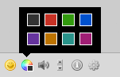

# Colors using XHTML formatted messages
Send and receive colored messages.
This plugin is based on the [colors](https://github.com/candy-chat/candy-plugins/tree/master/colors) and, contrary
to the `colors` plugin, ensures that third party clients see the colors as well.



## Usage
To enable *Colors* you have to include its JavaScript code and stylesheet

```HTML
<script type="text/javascript" src="candyshop/colors-xhtml/candy.js"></script>
<link rel="stylesheet" type="text/css" href="candyshop/colors-xhtml/candy.css" />
```

Call its `init()` method after Candy has been initialized:

```javascript
Candy.init('/http-bind/', {
	view: {
		// make sure you enabled XHTML in order to display it properly.
		enableXHTML: true
	}
});

// enable Colors-XHTML plugin (default: 8 colors)
CandyShop.ColorsXhtml.init();

Candy.Core.connect();
```

To enable less or more colors enable it with e.g.:

```javascript
var colors = [
	'#333', '#fff'
	// etc, use as many as you'd like to
];

CandyShop.ColorsXhtml.init(colors);
```

**Please note**: you can't use the `colors` and the `colors-xhtml` plugin together.