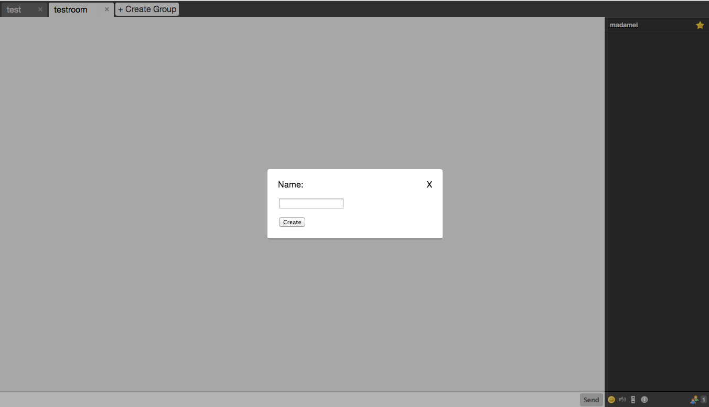

# Create Room UI

A plugin for Candy Chat to enable a clickable UI for creating new chatrooms.



## Usage
Include the JavaScript and CSS files:
```HTML
<script type="text/javascript" src="candyshop/createroom/createroom.js"></script>
<link rel="stylesheet" type="text/css" href="candyshop/createroom/createroom.css" />
```

To enable the Create Room plugin, add its `init` method _before_ you `init` Candy. You can pass it your chat subdomain as well:
```JavaScript
CandyShop.CreateRoom.init({
  subdomain: 'chat'
});
Candy.init('/http-bind', { ...
```
