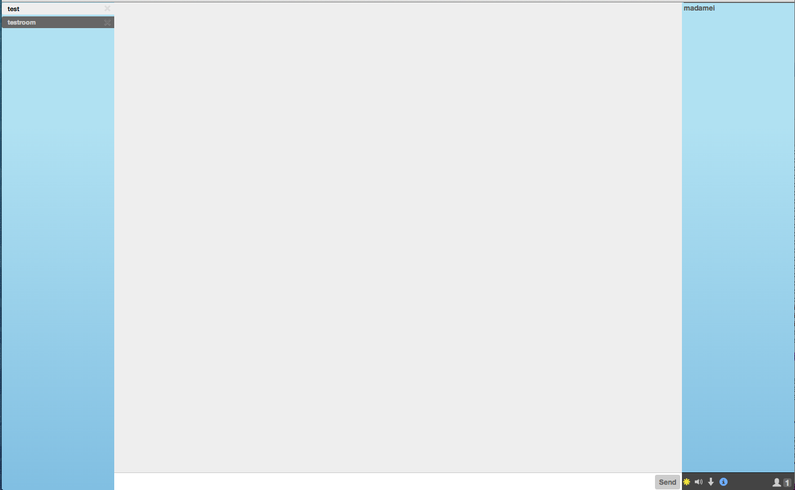

# Left Tabs + Bootstrap3 Icons

A plugin for Candy Chat to enable left tabs with simple Bootstrap3 theme elements.



## Usage
Include the JavaScript and CSS files:
```HTML
<script type="text/javascript" src="candyshop/lefttabs/lefttabs.js"></script>
<link rel="stylesheet" type="text/css" href="candyshop/lefttabs/lefttabs.css" />
```
Remember to include your Bootstrap3 CSS/JS files! They are not included in this plugin. ;)

To enable this Left Tabs plugin, add its `init` method _before_ you `init` Candy:
```JavaScript
CandyShop.LeftTabs.init();
Candy.init('/http-bind', { ...
```
## Compatibility with other plugins

Make sure to `init` it after all other plugins, but before the Candy `init`.

1. CreateRoom
