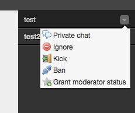

# Modify role
Adds **add moderator** and **remove moderator** privilege links to context menu.



## Usage
To enable *Modify role* you have to include its JavaScript code and stylesheet:

```HTML
<script type="text/javascript" src="candyshop/modify-role/candy.js"></script>
<link rel="stylesheet" type="text/css" href="candyshop/modify-role/candy.css" />
```

Call its `init()` method after Candy has been initialized:

```JavaScript
Candy.init('/http-bind/');

// enable ModifyRole plugin
CandyShop.ModifyRole.init();

Candy.Core.connect();
```

## Credits
Thanks to [famfamfam silk icons](http://www.famfamfam.com/lab/icons/silk/) for the icons.

## License
MIT