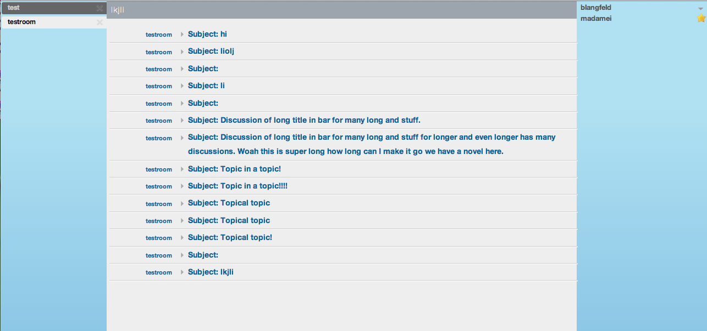

# MUC Room Bar

A plugin for Candy Chat to enable a room bar that displays the room topic and allows moderators to edit it with a click, as well as adds a button to pop up a GUI for inviting users to a MUC.

## Dependencies
 Depends on `CandyShop.StaticLobby` for its `Invite` object's `Send` method.

With LeftTabs plugin:


Without LeftTabs plugin:


## Usage
Include the JavaScript and CSS files for the plugin:
```HTML
<script type="text/javascript" src="candyshop/mucroombar/mucroombar.js"></script>
<link rel="stylesheet" type="text/css" href="candyshop/mucroombar/mucroombar.css" />
```
Also be sure to include [Twitter Typeahead](https://github.com/twitter/typeahead.js)'s packaged JS file (includes Bloodhound).


To enable this plugin, add its `init` method after you `init` Candy:
```JavaScript
CandyShop.RoomBar.init();
```
