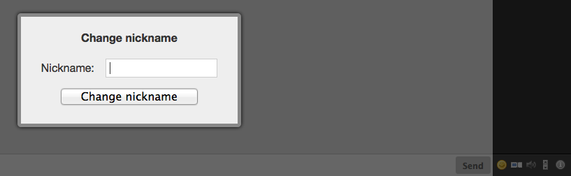

# Nickchange
Enable your users to change the nick using a toolbar icon.



## Usage
To enable *Nickchange* you have to include its JavaScript code and stylesheet:

```HTML
<script type="text/javascript" src="candyshop/nickchange/candy.js"></script>
<link rel="stylesheet" type="text/css" href="candyshop/nickchange/candy.css" />
```

Call its `init()` method after Candy has been initialized:

```JavaScript
Candy.init('/http-bind/');

// enable Nickchange plugin
CandyShop.Nickchange.init();

Candy.Core.connect();
```

## Credits
Thanks to [famfamfam silk icons](http://www.famfamfam.com/lab/icons/silk/) for the rename icon.