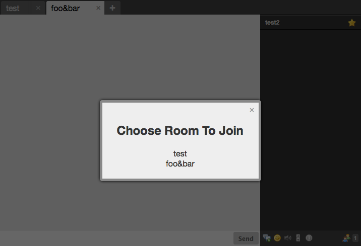

# RoomPanel
Adds Icon show a lists rooms, also allows to show rooms upon connection and when all rooms are closed.



## Usage
To enable *RoomPanel* you have to include its JavaScript code and stylesheet:

```HTML
<script type="text/javascript" src="candyshop/roomPanel/roomPanel.js"></script>
<link rel="stylesheet" type="text/css" href="candyshop/roomPanel/default.css" />
```

Call its `init()` method after Candy has been initialized:

```JavaScript
Candy.init('/http-bind/', {core: {autojoin: []}});

// enable RoomPanel plugin
CandyShop.RoomPanel.init({
    // domain that hosts the muc rooms, only required if autoDetectRooms is enabled
    mucDomain: 'conference.example.com',

    // allow you to force a list of rooms, only required if autoDetectRoom is disabled
    roomList: [
        {
            name: 'my room',
            jid:  'my-room@conference.example.com'
        },
        {
            name: 'other room',
            jid:  'other-room@conference.example.com'
        }
    ],

    // show room list if all rooms are closed, default value is true. [optional]
    showIfAllTabClosed: true,

    // show '+' at the end of the room tabs
    showTab: true,

    // show icon in toolbar to show room list
    showToolbarIcon: false,


    // detect rooms before showing list, default value is true. [optional]
    autoDetectRooms: true,

    // how long in seconds before refreshing room list, default value is 600. [optional]
    roomCacheTime: 600
});

Candy.Core.connect();
```

