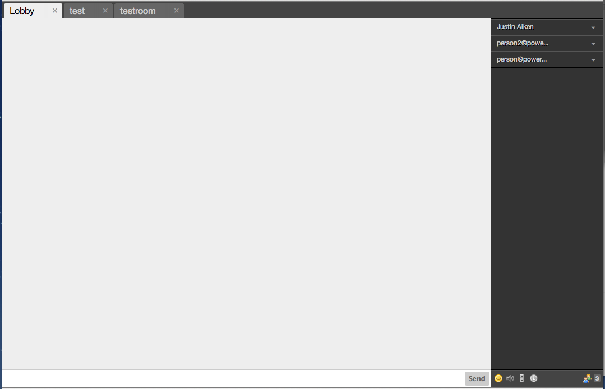

# Static Lobby

A plugin for Candy Chat to enable a static lobby with a global roster. Also allows you to invite people from your global roster to other MUCs you are participating in.



## Usage
Include the JavaScript and CSS files, as well as the Strophe roster plugin:
```HTML
<script type="text/javascript" src="candyshop/staticlobby/staticlobby.js"></script>
<link rel="stylesheet" type="text/css" href="candyshop/staticlobby/staticlobby.css" />
```

To enable this Static Lobby plugin, add its `init` method _after_ you `init` Candy, but _before_ you `connect` Candy:
```JavaScript
CandyShop.StaticLobby.init();
Candy.connect()
```
