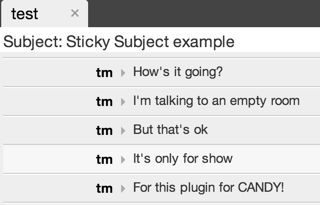

# Sticky subject plugin
This plugin will retain the subject of the room at the top of the chat panel



## Usage
Include the JavaScript and CSS files:
```HTML
<script type="text/javascript" src="path_to_plugins/stickysubject/candy.js"></script>
<link rel="stylesheet" type="text/css" href="path_to_plugins/stickysubject/candy.css" />
```

Call its `init()` method after Candy has been initialized:
```JavaScript
Candy.init('/http-bind/');

CandyShop.StickySubject.init();

Candy.Core.connect();
```